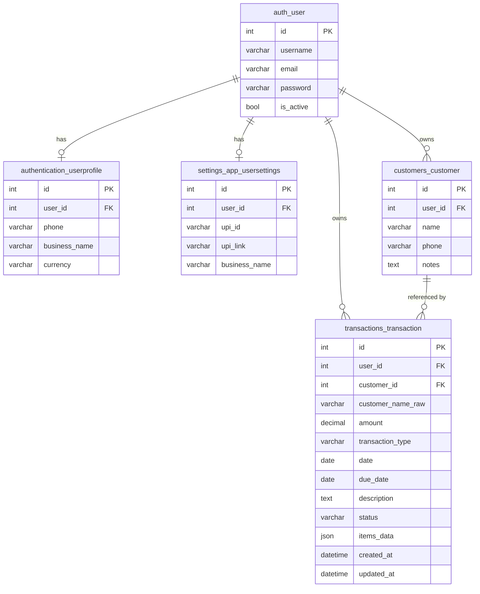

# LedgerVoice — Complete Project Explanation

> **What is LedgerVoice?**
> LedgerVoice is a local-only, voice-powered accounting and ledger application built for small businesses and shopkeepers. A user can speak a transaction in plain English (e.g., *"Rahul borrowed 500 rupees, will pay in 2 weeks"*), and the app automatically extracts the customer name, amount, transaction type, and due date — then saves it as a structured ledger record. No login is required. The app runs entirely on your local machine.

---

## Table of Contents

1. [Project Overview](#1-project-overview)
2. [Project Structure](#2-project-structure)
3. [Removed Pages & No Authentication](#3-removed-pages--no-authentication)
4. [Core Features](#4-core-features)
5. [Database Architecture](#5-database-architecture)
6. [Database Setup](#6-database-setup)
7. [Environment Variables](#7-environment-variables)
8. [Development Setup](#8-development-setup)
9. [Running the Project](#9-running-the-project)
10. [Database Commands](#10-database-commands)
11. [API Architecture](#11-api-architecture)
12. [Frontend Architecture](#12-frontend-architecture)
13. [Data Flow](#13-data-flow)
14. [Future PostgreSQL Migration](#14-future-postgresql-migration)
15. [Troubleshooting](#15-troubleshooting)
16. [Important Development Rules](#16-important-development-rules)

---

## 1. Project Overview

### What the application does

LedgerVoice lets shopkeepers and small business owners record financial transactions by voice — with no typing, no login, and no complex setup.

### Main Technologies

| Layer | Technology |
|---|---|
| Backend | Python 3, Django 4.2, Django REST Framework |
| NLP | spaCy `en_core_web_sm` + custom rule-based parser |
| Database | SQLite (local, zero-config) |
| Frontend | AngularJS 1.8 SPA |
| WhatsApp | WhatsApp `wa.me` URL API |
| Voice API | Browser Web Speech API + MediaRecorder |

### Overall Architecture

Django serves both the REST API (`/api/*`) and the AngularJS SPA (`/` → `frontend/index.html`). No separate frontend server is needed.

---

## 2. Project Structure

```
voicekhata/
├── backend/                        ← Django project root
│   ├── voicekhata_backend/         ← Django settings, URLs, WSGI
│   │   ├── settings.py             ← All configuration
│   │   └── urls.py                 ← Top-level URL routing
│   ├── authentication/             ← User model (UserProfile) — schema only
│   ├── transactions/               ← Core transaction CRUD & local user
│   │   ├── models.py               ← Transaction model (canonical schema)
│   │   ├── views.py                ← TransactionViewSet (AllowAny, local_user)
│   │   ├── serializers.py          ← DRF serializers
│   │   └── management/commands/
│   │       └── ensure_local_user.py ← Creates the local_user for no-auth mode
│   ├── voice/                      ← NLP parsing endpoint
│   │   ├── parsers.py              ← spaCy + rule-based parser (882 lines)
│   │   └── views.py                ← SpeechParseView (AllowAny)
│   ├── customers/                  ← Customer model (schema preserved)
│   ├── inventory/                  ← Inventory model (schema preserved)
│   ├── insights/                   ← Analytics (schema preserved)
│   ├── reminders/                  ← Reminders (schema preserved)
│   ├── settings_app/               ← UserSettings model (schema preserved)
│   ├── manage.py                   ← Django CLI
│   ├── requirements.txt            ← Python dependencies
│   ├── .env                        ← Local environment variables
│   ├── .env.example                ← Template for environment setup
│   └── db.sqlite3                  ← SQLite database file
│
└── frontend/                       ← AngularJS SPA
    ├── index.html                  ← SPA shell (navbar, ng-view, scripts)
    ├── css/
    │   ├── style.css               ← All custom styles
    │   └── fontawesome.min.css     ← Icons (self-hosted)
    ├── js/
    │   ├── app.js                  ← Angular module, routes, MainController
    │   ├── controllers/
    │   │   ├── VoiceInputController.js  ← Record voice, parse, confirm, save, WhatsApp
    │   │   └── TransactionController.js ← Transaction history, edit, delete, WhatsApp
    │   └── services/
    │       ├── apiService.js            ← $http wrapper for all API calls
    │       ├── voiceService.js          ← Microphone + Web Speech API + MediaRecorder
    │       ├── transactionService.js    ← CRUD for /api/transactions/
    │       ├── customerService.js       ← Customer API calls
    │       └── toastService.js          ← In-app toast notifications
    └── views/
        ├── voice.html              ← Voice recording + confirmation UI
        └── transactions.html       ← Transaction history table
```

---

## 3. Removed Pages & No Authentication

### Intentionally Removed

| Page | Route | What Was Removed |
|---|---|---|
| **Home / Landing** | `/` | `views/landing.html`, `controllers/LandingController.js` |
| **Settings** | `/settings` | `views/settings.html`, `controllers/SettingsController.js`, `services/settingsService.js` |
| **Profile** | (was part of Settings) | "Account Settings" dropdown in navbar |

All three routes now redirect to `/voice`. No broken URLs — all old paths redirect cleanly.

### No Authentication

This application is **intentionally local-only and requires no login**.

- Login/Register pages & Auth nav elements
- Unnecessary View files (`landing.html`, `settings.html`, `login.html`, `register.html`, `dashboard.html`, `customers.html`, `inventory.html`, `insights.html`, `reminders.html`)
- Unnecessary Controller files (`LandingController.js`, `SettingsController.js`, `AuthController.js`, `DashboardController.js`, `CustomerController.js`, `InventoryController.js`, `InsightController.js`, `ReminderController.js`)
- Unnecessary Service files (`authService.js`, `settingsService.js`, `inventoryService.js`, `insightService.js`, `reminderService.js`)

**How transactions still work without auth:** Django's `Transaction` model has a required `user` FK. Rather than changing the schema, all transactions are assigned to a single `local_user` account automatically created by `ensure_local_user.py`. The API endpoints use `permission_classes = [AllowAny]`.

---

## 4. Core Features

### Voice Record (Records + Text)

Users click the microphone button → browser captures live speech via Web Speech API → transcript appears in real time → on stop, the transcript is sent to the backend NLP parser → structured data (customer name, amount, type, due date) returns → user reviews/edits → saves.

### NLP Pipeline & Items List Voice Processing

Located in `backend/voice/parsers.py` (with local parsing additions in `VoiceInputController.js`). Processing steps:

1. **Items List Detection**: If the transcript starts with or contains the phrase **"items list"**, the frontend activates multi-item transaction processing.
2. **Independent Item Extraction**: Splits the spoken text after the trigger into separate items (using commas, periods, or newlines) and processes each item sequentially in a collection processing loop.
3. **Database / localStorage Lookup**: For each item, normalizes the name and searches the inventory catalog stored in `localStorage` under `ledgervoice_inventory`.
4. **Unit & Price Resolution**:
   - Spoken explicit prices (e.g. *"Sugar 5 at 50 rupees"*) override stored inventory prices.
   - If no explicit price is spoken, the default unit and price are resolved from the inventory catalog.
   - If the item is missing from the catalog, the user is alerted to input the missing Item name, Unit, and Price in the UI.
5. **Inventory Updating**: On transaction save, the stock for each catalog item is automatically updated (deducted by the purchased quantity) and persisted.
6. **Phone & Date Parsing**: Extracts phone numbers and relative due dates ("next week", "in 2 months") to complete the metadata context.

### Transaction History

Full CRUD table at `/transactions`. Supports:
- Filter by type (credit / payment / sales / expense)
- Text search across customer name and description
- Edit any existing transaction
- Delete transactions
- Send WhatsApp message for any past transaction

### WhatsApp

Two integration points:

1. **After saving** (Voice Record page): immediately share a receipt/reminder via WhatsApp
2. **From history** (Transactions page): send message for any past transaction

Messages are pre-formatted per transaction type:
- Credit → "*Ledger Voice Reminder*" with due date
- Payment → "*Ledger Voice Receipt*" confirming payment
- Sales → "*Ledger Voice Invoice*" with purchase total

### Reports / Summary

Reports and summary view of transaction history is available under the Transaction History view. Individual transaction details can be shared instantly over WhatsApp.

---

## 5. Database Architecture

### Current Storage: Browser localStorage

For the current local setup, transactions are saved and loaded directly from the browser's `localStorage` (key: `ledgervoice_transactions`). This provides a fast, zero-dependency, local-only experience.

### Backend Database: SQLite (Preserved for Future Postgres Migration)

All Django database apps, models, and migrations (`authentication`, `transactions`, `customers`, `inventory`, `reminders`, `settings_app`) have been fully preserved on the backend to keep the database schema canonical. When shifting to PostgreSQL in the future, the frontend can be switched back to API-based endpoints, and the Django SQLite/PostgreSQL setup will serve as the storage backend.

### Database Relationship Diagram



### Tables Reference

| Table | App | Status | Purpose |
|---|---|---|---|
| `auth_user` | Django built-in | ✅ Active | Local user account (local_user) |
| `authentication_userprofile` | `authentication` | ✅ Schema kept | Extended user profile |
| `transactions_transaction` | `transactions` | ✅ Core | All ledger records |
| `customers_customer` | `customers` | ✅ Schema kept | Customer directory |
| `settings_app_usersettings` | `settings_app` | ✅ Schema kept | Per-user settings |
| `inventory_*` | `inventory` | ✅ Schema kept | Stock management |
| `reminders_reminder` | `reminders` | ✅ Schema kept | Payment reminders |

### Transaction Model Fields

```python
class Transaction(models.Model):
    TRANSACTION_TYPES = [
        ('credit',   'Credit (Gave / Loaned)'),
        ('payment',  'Payment (Received / Got)'),
        ('cash_in',  'Cash In'),
        ('cash_out', 'Cash Out'),
        ('sales',    'Sales'),
        ('expense',  'Expense'),
    ]
    STATUS_CHOICES = [
        ('pending',   'Pending'),
        ('completed', 'Completed'),
        ('cancelled', 'Cancelled'),
        ('settled',   'Settled'),
    ]

    user              = ForeignKey(User)        # Always local_user in no-auth mode
    customer          = ForeignKey(Customer)    # Optional link to customer record
    customer_name_raw = CharField(150)          # Raw name from voice
    amount            = DecimalField(12,2)
    transaction_type  = CharField(choices=TRANSACTION_TYPES)
    date              = DateField
    due_date          = DateField (nullable)
    description       = TextField (nullable)    # NLP notes
    status            = CharField(choices=STATUS_CHOICES)
    items_data        = JSONField (nullable)    # Sales item list
    created_at        = DateTimeField (auto)
    updated_at        = DateTimeField (auto)
```

---

## 6. Database Setup

SQLite requires no installation. Django creates `db.sqlite3` automatically.

```bash
# 1. Clone the repository and enter backend
cd voicekhata/backend

# 2. Activate virtual environment
.\venv\Scripts\activate        # Windows
source venv/bin/activate       # Linux/Mac

# 3. Install dependencies
pip install -r requirements.txt

# 4. Copy environment file
copy .env.example .env         # Windows
cp .env.example .env           # Linux/Mac

# 5. Run migrations (creates all tables in db.sqlite3)
python manage.py migrate

# 6. Create the local user (required for no-auth transaction saving)
python manage.py ensure_local_user

# 7. Start the server
python manage.py runserver 8000
```

---

## 7. Environment Variables

| Variable | Required | Default | Purpose |
|---|---|---|---|
| `SECRET_KEY` | Yes | (set in .env) | Django cryptographic signing key |
| `DEBUG` | No | `True` | Django debug mode |
| `ALLOWED_HOSTS` | No | `*` | Hosts allowed to serve the app |
| `GEMINI_API_KEY` | No | — | Gemini AI API key (future audio transcription) |
| `CORS_ALLOWED_ORIGINS` | No | localhost variants | Allowed CORS origins |

> **Note**: No database env vars needed for SQLite. PostgreSQL vars will be introduced in Phase 2.python manage.py runserver 8000


---

## 8. Development Setup

```bash
# 1. Clone
git clone <repository-url>
cd voicekhata/backend

# 2. Create virtual environment (if venv folder missing)
python -m venv venv

# 3. Activate
.\venv\Scripts\activate        # Windows PowerShell
source venv/bin/activate       # Linux/Mac

# 4. Install Python packages
pip install -r requirements.txt

# 5. Install spaCy English model (auto-downloads on first parse, but you can pre-install)
python -m spacy download en_core_web_sm

# 6. Set up environment
copy .env.example .env

# 7. Initialize database
python manage.py migrate
python manage.py ensure_local_user

# 8. Start
python manage.py runserver 8000

# Open http://127.0.0.1:8000/
```

---

## 9. Running the Project

```bash
cd voicekhata/backend
.\venv\Scripts\activate
python manage.py runserver 8000
```

Then open **http://127.0.0.1:8000/** in Chrome or Edge.

> **Browser requirement**: Chrome or Edge — Web Speech API for live voice transcript is not available in Firefox.

The app opens directly on the **Voice Record** page. No login needed.

---

## 10. Database Commands

```bash
# Apply all migrations
python manage.py migrate

# Create a new migration after model changes
python manage.py makemigrations

# Create/ensure local_user exists
python manage.py ensure_local_user

# Open Django shell (inspect database)
python manage.py shell

# Django admin interface (view all tables)
python manage.py createsuperuser
# then visit http://127.0.0.1:8000/admin/
```

---

## 11. API Architecture

### Endpoints

| Method | URL | Feature | Description |
|---|---|---|---|
| POST | `/api/voice/parse/` | Text / Records | Parse voice transcript → structured JSON |
| GET | `/api/transactions/` | Transaction History | List all transactions (filterable) |
| POST | `/api/transactions/` | Records | Create new transaction |
| GET | `/api/transactions/{id}/` | Transaction History | Get single transaction |
| PUT/PATCH | `/api/transactions/{id}/` | Records | Update transaction |
| DELETE | `/api/transactions/{id}/` | Records | Delete transaction |

> **Authentication**: None. All endpoints use `permission_classes = [AllowAny]`.

### Voice Parse Endpoint

```
POST /api/voice/parse/
Content-Type: application/json

{ "transcript": "Rahul borrowed 500 rupees will pay in 2 weeks" }

→ 200 OK
{
  "customer_name": "Rahul",
  "customer_phone": null,
  "amount": 500.0,
  "transaction_type": "credit",
  "due_date": "2026-09-02",
  "notes": "Rahul borrowed 500 rupees will pay in 2 weeks",
  "date": "2026-08-19",
  "status": "pending",
  "items": null,
  "is_sales": false,
  "parser_used": "spacy-nlp"
}
```

### Transaction Filters

```
GET /api/transactions/?type=credit
GET /api/transactions/?type=payment
GET /api/transactions/?search=rahul
GET /api/transactions/?status=pending
```

---

## 12. Frontend Architecture

### Entry Point

`frontend/index.html` — loaded by Django for all non-API, non-static routes. AngularJS bootstraps from this file via `ng-app="ledgerVoiceApp"`.

### Routing (`frontend/js/app.js`)

| Route | View | Controller |
|---|---|---|
| `/voice` | `views/voice.html` | `VoiceInputController` |
| `/transactions` | `views/transactions.html` | `TransactionController` |
| Everything else | — | Redirects to `/voice` |

### Controllers

#### `VoiceInputController` — Core recording + save flow

State machine:
1. **Idle** → mic button ready
2. **Recording** → `isRecording = true`, live transcript shown
3. **Parsing** → `isParsing = true`, NLP call in progress
4. **Confirmation** → `showConfirmation = true`, edit extracted fields
5. **Saved** → `isSaved = true`, WhatsApp sharing option shown

Two modes:
- **Standard**: credit / payment — customer name, amount, type, due date
- **Sales**: itemized bill — table of items with name, qty, unit, price

#### `TransactionController` — History view

- Loads all transactions on init
- Filter by type, search by name/amount
- Edit modal (full update)
- Delete with confirmation
- WhatsApp button per row

## 12. Frontend Architecture & JS Files Deep Dive

All frontend logic is structured as an AngularJS Single Page Application (SPA). Below is a file-by-file explanation of every JavaScript controller and service in the project, explaining **where it is used**, **what is used inside it**, and **how it works**.

---

### 1. App Configuration (`frontend/js/app.js`)
- **Where is it used?**  
  Loaded globally in `frontend/index.html` at line 87. It bootstraps the entire AngularJS application under the `ng-app="ledgerVoiceApp"` directive.
- **What is used inside?**  
  - External Modules: `ngRoute` (AngularJS routing)
  - Core Services: `$routeProvider`, `$locationProvider`
- **How it works:**  
  - Defines the core Angular module: `var app = angular.module('ledgerVoiceApp', ['ngRoute']);`.
  - Configures client-side routing using the `$routeProvider`:
    - `/voice` maps to `views/voice.html` with `VoiceInputController`.
    - `/transactions` maps to `views/transactions.html` with `TransactionController`.
    - Redirects legacy pages (e.g., `/settings`, `/login`, `/dashboard`, etc.) directly to `/voice`.
  - Declares the global `MainController`:
    - Manages global toast alerts (`$scope.toasts`).
    - Exposes utility `$scope.isActive(viewLocation)` to highlight the active menu item in the navigation bar.
    - Exposes `$scope.removeToast(index)` to dismiss toast alerts from the notification layer.

---

### 2. Voice Service (`frontend/js/services/voiceService.js`)
- **Where is it used?**  
  Loaded in `index.html` (line 92) and injected as a dependency into `VoiceInputController`.
- **What is used inside?**  
  - Web APIs: Browser-native `SpeechRecognition` (or `webkitSpeechRecognition`), `navigator.mediaDevices.getUserMedia` for microphone capture, and the `MediaRecorder` API.
  - Angular Services: `apiService` (for sending parser requests), `$rootScope` (to broadcast events globally).
- **How it works:**  
  - **`isSupported`**: Checks if the browser supports mediaDevices and getUserMedia.
  - **`startRecording()`**:
    - requests access to the user's microphone.
    - instantiates `SpeechRecognition` in continuous mode with interim results, updating the raw text transcription dynamically.
    - initializes a `MediaRecorder` instance using `audio/webm` type, compiling raw audio data chunks in memory.
    - broadcasts `'voice:statusChanged'` with `{ isRecording: true }`.
  - **`stopRecording()`**:
    - Stops the `MediaRecorder`, which automatically triggers the browser's mic release (`MediaStreamTrack.stop()`).
    - Triggers `mediaRecorder.onstop` which combines the audio chunks into a `Blob`.
    - Broadcasts the `'voice:audioReady'` event carrying the audio Blob.
  - **`parseTranscript(text)`**: Posts the captured string to the backend endpoint `/voice/parse/` via the `apiService`.

---

### 3. Transaction Service (`frontend/js/services/transactionService.js`)
- **Where is it used?**  
  Loaded in `index.html` (line 93). Injected into `VoiceInputController` (to save new records) and `TransactionController` (to query/manage records).
- **What is used inside?**  
  - Browser API: `localStorage` (reads/writes JSON strings under key `'ledgervoice_transactions'`).
  - Angular Services: `$q` (constructs promises to mimic async backend operations).
- **How it works:**  
  - **`getAll(params)`**:
    - Fetches the raw array of transactions from `localStorage`.
    - If `params.type` is set, filters records by transaction type (credit, payment, sales, expense).
    - If `params.search` is set, matches customer name, description notes, or amount against the keyword.
    - Returns a resolved promise containing the final array.
  - **`create(txData)`**:
    - Generates a unique ID prefix (`tx_` + timestamp + random token).
    - Injects ISO timestamps for creation and modification dates.
    - Inserts the new transaction at index `0` (newest first).
    - Writes the updated list back to `localStorage`.
  - **`update(id, txData)`**:
    - Locates the index of the record matching the ID.
    - Updates its fields and timestamp, saving changes back to `localStorage`.
  - **`delete(id)`**:
    - Filters out the item matching the target ID and saves the pruned list back to `localStorage`.

---

### 4. Customer Service (`frontend/js/services/customerService.js`)
- **Where is it used?**  
  Loaded in `index.html` (line 94). Injected into `TransactionController` to populate auto-complete customer input datalists.
- **What is used inside?**  
  - Angular Services: `$q`, `transactionService`.
- **How it works:**  
  - **`getAll()`**:
    - Resolves the promise with a unique list of customers.
    - Queries all stored transactions via `transactionService.getAll()`.
    - Iterates over each transaction, extracts the customer name, and populates a map to filter duplicates.
    - Returns the list as an array of customer name objects (`[{ name: 'Amit' }, ...]`).

---

### 5. Toast Service (`frontend/js/services/toastService.js`)
- **Where is it used?**  
  Loaded in `index.html` (line 90). Injected into all controllers to trigger UI notifications.
- **What is used inside?**  
  - Angular Services: `$timeout` (automatically removes messages).
- **How it works:**  
  - Maintains a local array `toasts = []`.
  - Provides four style helper methods: `success()`, `danger()`, `warning()`, and `info()`.
  - When called, pushes a toast object `{ message, type }` into the list.
  - Schedules a `$timeout` callback to automatically remove the toast after `4000ms`.

---

### 6. API Service (`frontend/js/services/apiService.js`)
- **Where is it used?**  
  Loaded in `index.html` (line 91). Injected into all endpoints-hitting services (like `voiceService`).
- **What is used inside?**  
  - Angular Services: `$http`, `API_BASE_URL` constant.
- **How it works:**  
  - Serves as an abstraction layer over AngularJS's `$http` service.
  - Appends `/api` to the start of all URLs.
  - Exposes `get(url, params)`, `post(url, data, config)`, `put(url, data)`, and `delete(url)`.

---

### 7. Voice Input Controller (`frontend/js/controllers/VoiceInputController.js`)
- **Where is it used?**  
  Injected into the Voice Recording View (`frontend/views/voice.html`).
- **What is used inside?**  
  - Angular Services: `$scope`, `$window` (for WhatsApp redirects), `voiceService`, `transactionService`, `toastService`.
- **How it works:**  
  - **Mic Controls**: `toggleRecording()` starts/stops microphone capturing using the `voiceService`.
  - **Live Transcript binding**: Captures events like `'voice:transcriptUpdated'` to display spoken text in real-time.
  - **NLP extraction**: Captures `'voice:audioReady'`, calling `processSpeech()` to send the transcript to the Django parser.
  - **Handling Response**: `handleParseResponse(res)` receives JSON:
    - If `res.data.is_sales` is true, sets `$scope.isSalesMode = true` and fills item tables.
    - If it's a credit/payment, sets standard fields (customer name, amount, due date).
    - Sets `$scope.showConfirmation = true` to display the edit form.
  - **Save Transaction**: `saveTransaction()` performs validation and calls `transactionService.create()`. On success, sets `$scope.isSaved = true` and shows the success/sharing panel.
  - **WhatsApp Message**: `shareWhatsApp()` compiles the saved record and redirects the user to the WhatsApp send link.

---

### 8. Transaction Controller (`frontend/js/controllers/TransactionController.js`)
- **Where is it used?**  
  Injected into the Transactions View (`frontend/views/transactions.html`).
- **What is used inside?**  
  - Angular Services: `$scope`, `transactionService`, `customerService`, `toastService`.
- **How it works:**  
  - **`loadTransactions()`**: Calls `transactionService.getAll()` with search queries or category filters and assigns them to `$scope.transactions`.
  - **`openAddModal()` / `openEditModal(tx)`**: Sets up the target transaction object (`$scope.currentTx`) and opens the Bootstrap modal dialog.
  - **`saveTransaction()`**: Validates input data and calls `transactionService.create()` or `transactionService.update()`, refreshing the list on success.
  - **`deleteTransaction(tx)`**: Prompts the user with a browser confirm dialog and calls `transactionService.delete()` to remove the item.
  - **`sendWhatsApp(tx)`**: Triggers a custom text receipt/reminder matching the category and opens the WhatsApp Web client page.

---

## 13. Data Flow

```
User speaks into microphone
        ↓
Browser Web Speech API (captures speech and prints live transcript)
        ↓
voiceService.stopRecording() → Emits "voice:audioReady" event
        ↓
VoiceInputController.processSpeech()
        ↓
POST /api/voice/parse/  { transcript: "..." }
        ↓
Django REST View (runs spaCy NLP + Rule-based intent extractors)
        ↓
Parsed JSON object returned to browser
        ↓
Confirmation Form displayed in browser UI (allowing manual edits)
        ↓
User clicks "Save Transaction"
        ↓
angular transactionService.create()
        ↓
Browser LocalStorage (key: ledgervoice_transactions)
        ↓
Success Panel: User shares receipt text instantly via WhatsApp
```

---

## 14. Future PostgreSQL Migration

> PostgreSQL is **intentionally NOT being used right now.**

When PostgreSQL is introduced (Phase 2):

1. The original schema (all existing Django ORM models) is the canonical schema — no redesign
2. Run `python manage.py migrate` against PostgreSQL — all existing migrations apply cleanly
3. Set DB env vars in `.env` (see `.env.example` for the exact names)
4. `local_user` must be re-created: `python manage.py ensure_local_user`
5. No table renaming or schema changes needed — just switch the engine

---

## 15. Troubleshooting

### spaCy model missing
```
OSError: [E050] Can't find model 'en_core_web_sm'
```
**Fix:** `python -m spacy download en_core_web_sm`

### Port 8000 already in use
```
Error: That port is already in use.
```
**Fix:** `python manage.py runserver 8001` and open `http://127.0.0.1:8001/`

### No speech transcript captured
- Ensure you are using **Chrome or Edge** (Firefox does not support Web Speech API)
- Grant microphone permission when prompted
- Check that your microphone is not muted in Windows settings

### Transactions not saving
- Check browser console (F12) for API errors
- Ensure `python manage.py ensure_local_user` was run
- Check `python manage.py check` reports no issues

### Database locked error
```
django.db.utils.OperationalError: database is locked
```
**Fix:** Only one Django runserver process should be running. Kill other instances.

### "No module named 'dotenv'"
```
ModuleNotFoundError: No module named 'dotenv'
```
**Fix:** `pip install -r requirements.txt`

---

## 16. Important Development Rules

1. **SQLite is the current database.** PostgreSQL will be added later.
2. **The original project schema is canonical.** Do not redesign, rename, or duplicate tables.
3. **All transactions use `local_user`.** Do not add multi-user authentication.
4. **Do not add authentication.** No login, signup, or user sessions.
5. **Do not reintroduce Home, Settings, or Profile pages.**
6. **Keep Records, Text/NLP, Reports / Summary, WhatsApp, and Transaction History working.**
7. **Never commit secrets** (API keys, passwords) to version control.
8. **Prefer migrations over destructive database resets.**
9. **When PostgreSQL is introduced, reuse existing migrations** — do not recreate the schema.

---

## Final Verification Report

### Changed
- `backend/voicekhata_backend/settings.py` — SQLite hardcoded, DRF permission set to AllowAny, JWT auth disabled
- `backend/transactions/views.py` — AllowAny permission, local_user for all reads/writes
- `backend/voice/views.py` — AllowAny permission, inventory lookup uses local_user
- `backend/transactions/management/commands/ensure_local_user.py` — **NEW** — creates local_user
- `frontend/js/app.js` — JWT interceptor removed, auth guards removed, direct routing to /voice
- `frontend/index.html` — Auth nav/buttons/dropdowns removed, scripts reduced to essentials
- `frontend/js/controllers/VoiceInputController.js` — Removed `$location` dependency
- `frontend/js/controllers/TransactionController.js` — Removed `authService` and `settingsService`
- `backend/.env` — Simplified to SQLite-only config
- `backend/.env.example` — Updated with clear Phase 1/Phase 2 docs

### Removed (UI only — files kept on disk)
- **Home page** (`/`) — LandingController, landing.html no longer routed
- **Settings page** (`/settings`) — SettingsController, settings.html, settingsService no longer loaded
- **Profile / Account Settings** — dropdown item removed from navbar
- **Login / Register pages** — routes redirect to /voice, no buttons in navbar
- **JWT auth interceptor** — removed from app.js
- **authService** — removed from all active controllers
- **Route auth guards** — removed from $routeChangeStart

### Preserved (Fully Working)
- ✅ Voice Recording and NLP parsing
- ✅ Transaction History (list, filter, search, edit, delete)
- ✅ WhatsApp sharing (from Voice page and Transactions page)
- ✅ All original DB tables and schema intact

### Database
- SQLite in use (`backend/db.sqlite3`)
- PostgreSQL NOT used
- All original tables preserved
- `local_user` created via `ensure_local_user` command

### Startup Commands
```bash
cd voicekhata/backend
.\venv\Scripts\activate
python manage.py migrate
python manage.py ensure_local_user
python manage.py runserver 8000
# → http://127.0.0.1:8000/
```

---

## 17. Items List Parsing & Fractional Quantity Recognition

### The Problem
Previously, voice parsing failed when users spoke:
1. **Fractional / Spoken quantities**: like `"half kg"`, `"1 and half kg"`, `"one and a half liters"`, `"quarter kg"`, or `"1/2 kg"`.
2. **Continuous unpunctuated item streams**: like `"items list sugar 2kg 80 rupees oil 2 liter 100 rupees wheat 1 and half kg 90 rupees"`, where items were spoken without explicit commas or "and" connectors between items. Conjunction splitting also previously broke compound quantities like `"1 and half"`.

### The Solution Architecture
We implemented a dual-layer NLP & Regex extraction engine in both `backend/voice/parsers.py` and `frontend/js/services/itemsParser.js`:

1. **Fraction & Quantity Normalizer (`parse_quantity_val` / `parseQuantityVal`)**:
   - Spoken single fractions: `"half"`, `"a half"`, `"half a"` → `0.5`, `"quarter"` → `0.25`, `"three quarter"` → `0.75`.
   - Compound spoken phrases: `"<number> and (a )?half"` (e.g. `"1 and half"`, `"one and a half"`, `"2 and half"`) → parses whole value and adds `+0.5`.
   - Mixed & slash fractions: `"1 1/2"`, `"1/2"`, `"3/4"` → evaluated as exact floats.
   - Word to number mapping: `"one"` through `"twelve"`, `"twenty"`, `"fifty"`, `"hundred"`.

2. **Smart Multi-Item Stream Segmenter (`extract_items_sequential_stream`)**:
   - **Protection of Compound Connectors**: Masks `"and"` inside quantity phrases (e.g. `"1 and half"` → `"1__AND__half"`) before splitting on inter-item conjunctions.
   - **Sequential Pattern Matching**: Recognizes boundaries when items are spoken back-to-back:
     - *Pattern A (Item first)*: `[Name] [Qty] [Unit] [Price]` → `"sugar 2kg 80 rupees"`, `"wheat 1 and half kg 90 rupees"`
     - *Pattern B (Quantity first)*: `[Qty] [Unit] (of)? [Name] [Price]` → `"2kg sugar 80 rupees"`, `"1 and half kg wheat 90 rupees"`
     - *Pattern C (Rate basis)*: `[Qty] [Unit] [Name] at [Rate] per [Unit]` → `"10 liters oil at 50 rupees per liter"`
   - Automatically computes per-unit price = `Total / Qty` and item total = `Qty * Price`.

3. **Customer Attribution Recognition (`extract_sales_customer` / `extractCustomer`)**:
   - Spoken customer clauses at the end or beginning of the items transcript (e.g. `"sold to Rahul"`, `"sold by Alex"`, `"customer Amit"`, `"to Rahul"`, `"for Priya"`) are automatically identified.
   - Cleans the customer phrase from the items list transcript so it doesn't pollute the product names or prices.
   - Sets `customer_name` directly in the transaction record, confirmation UI, and printable receipt.

---

## 18. Itemized Transaction Receipt Generation

### What is Generated
When any sales or credit/payment transaction is recorded, LedgerVoice renders a POS-style itemized receipt:

1. **Receipt Header**:
   - Clean gradient banner with official `#LV-<ID>` transaction reference tag.
   - Store name and system subtitle.
2. **Customer & Transaction Meta**:
   - Customer name (or "General / Cash Customer").
   - Transaction date & timestamp.
   - Customer WhatsApp contact number.
   - Transaction type badge (`SALES`, `CREDIT`, `PAYMENT`, `EXPENSE`).
3. **Itemized Breakdown Table**:
   - **Item Name**: Clean title-cased product name.
   - **Quantity & Unit**: e.g., `1.5 kg`, `2 litre`, `5 pcs`.
   - **Unit Price / Rate**: e.g., `₹60.00 / kg`.
   - **Item Total**: e.g., `₹90.00`.
4. **Financial Totals Section**:
   - Subtotal amount.
   - **Grand Total Sum**: Highlighted in bold green with currency symbol (`₹`).
5. **Interactive Receipt Actions**:
   - **Print Receipt**: Triggers `@media print` optimized invoice output (hiding UI chrome/navbars and printing the clean receipt card).
   - **WhatsApp Share**: Auto-generates a formatted markdown receipt text sent directly to the customer's phone number.

---

## 19. Modern Angular Component-Based Architecture

### Architectural Shift
In modern frontend development, monolithic `$scope`-driven controllers are replaced by **modular, reusable, and isolated Components**.

In this refactoring, we transitioned the AngularJS application into clean component-driven architecture using `app.component()` under `frontend/js/components/`:

```
frontend/js/
├── components/
│   ├── navbar.component.js            ← <app-navbar> Top nav & active state
│   ├── voiceRecorder.component.js     ← <voice-recorder> Audio capture & live transcription
│   ├── itemsExtractor.component.js    ← <items-extractor> Editable items list & inventory checks
│   ├── transactionReceipt.component.js← <transaction-receipt> Itemized receipt display & sharing
│   ├── transactionLedger.component.js ← <transaction-ledger> History, search, filters & receipt modals
│   └── toastNotifications.component.js← <toast-notifications> Global notification popups
├── controllers/
│   ├── VoiceInputController.js        ← Orchestrates speech flow and state transitions
│   └── TransactionController.js       ← Ledger page route controller
└── services/
    ├── itemsParser.js                 ← Client-side NLP & quantity fraction parser
    ├── voiceService.js                ← Web Speech & MediaRecorder
    ├── transactionService.js          ← LocalStorage CRUD
    ├── inventoryService.js            ← Catalog & stock levels
    ├── customerService.js             ← Customer list provider
    └── toastService.js                ← Notification manager
```

### Key Principles Implemented:

1. **Isolated Component Scope & Bindings**:
   - Components declare explicit inputs and outputs via `bindings`:
     - `<` One-way data input binding (e.g. `transaction: '<'`)
     - `=` Two-way data binding (e.g. `items: '='`, `transcript: '='`)
     - `&` Callback event output binding (e.g. `onSave: '&'`, `onReset: '&'`)
   - Avoids scope pollution and prevents accidental side-effects.

2. **Controller As `$ctrl` Syntax**:
   - Components use `$ctrl` in templates rather than raw `$scope` properties.
   - Clear encapsulation of data and methods inside the component controller.

3. **Component Lifecycle Hooks**:
   - `$onInit`: Initializes default states and event listeners.
   - `$onChanges`: Responds dynamically when bound parent inputs change.
   - `$onDestroy`: Cleans up active audio recording streams and timeouts when unmounting.

4. **Reusability**:
   - `<transaction-receipt>` is used both immediately after voice recording and inside the transaction ledger modal for reviewing past invoices.
   - `<voice-recorder>` encapsulates all microphone DOM animations and recording states independently.

